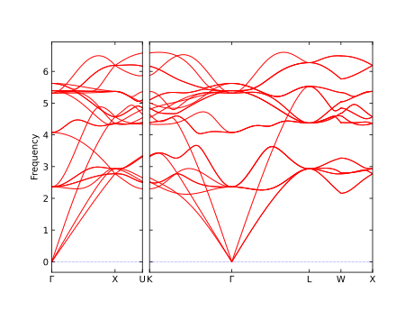

======================
Command line interface
======================

Jupyter Notebook tutorials illustrating the use of currently available calculations can be found in the `tutorials <https://github.com/stfc/janus-core/tree/main/docs/source/tutorials/cli>`_ documentation directory. This currently includes examples for:

.. |singlepoint| image:: https://colab.research.google.com/assets/colab-badge.svg
    :target: https://colab.research.google.com/github/stfc/janus-core/blob/main/docs/source/tutorials/cli/singlepoint.ipynb
    :alt: Launch single point Colab

.. |geomopt| image:: https://colab.research.google.com/assets/colab-badge.svg
    :target: https://colab.research.google.com/github/stfc/janus-core/blob/main/docs/source/tutorials/cli/geomopt.ipynb
    :alt: Launch geometry optimisation Colab

.. |md| image:: https://colab.research.google.com/assets/colab-badge.svg
    :target: https://colab.research.google.com/github/stfc/janus-core/blob/main/docs/source/tutorials/cli/md.ipynb
    :alt: Launch molecular dynamics Colab

.. |phonons| image:: https://colab.research.google.com/assets/colab-badge.svg
    :target: https://colab.research.google.com/github/stfc/janus-core/blob/main/docs/source/tutorials/cli/phonons.ipynb
    :alt: Launch phonons Colab

.. |neb| image:: https://colab.research.google.com/assets/colab-badge.svg
    :target: https://colab.research.google.com/github/stfc/janus-core/blob/main/docs/source/tutorials/cli/neb.ipynb
    :alt: Launch NEB Colab

- :doc:`Single Point </tutorials/cli/singlepoint>` |singlepoint|
- :doc:`Geometry Optimization </tutorials/cli/geomopt>` |geomopt|
- :doc:`Molecular Dynamics </tutorials/cli/md>` |md|
- :doc:`Phonons </tutorials/cli/phonons>` |phonons|
- :doc:`Nudged Elastic Band </tutorials/cli/neb>` |neb|

These make use of `WEAS Widget <https://weas-widget.readthedocs.io/en/latest/index.html>`_ for visualisation,
which can be installed using ``janus-core``'s ``visualise`` extra. For example:

.. code-block:: bash

    pip install janus-core[mace,visualise]

or

.. code-block:: bash

    pip install janus-core[all]


Basic usage
-----------

General help, including a description of all available commands, can be found by running:

.. code-block:: bash

    janus --help

This should return something similar to:

.. code-block:: bash

    Usage: janus [OPTIONS] COMMAND [ARGS]...

    Options:
      --version                       Print janus version and exit.
      --install-completion [bash|zsh|fish|powershell|pwsh]
                                      Install completion for the specified shell.
      --show-completion [bash|zsh|fish|powershell|pwsh]
                                      Show completion for the specified shell, to
                                      copy it or customize the installation.
      --help                          Show this message and exit.

    Commands:
      descriptors  Calculate MLIP descriptors.
      eos          Calculate equation of state.
      elasticity   Calculate elasticity tensors.
      geomopt      Perform geometry optimization and save optimized structure...
      md           Run molecular dynamics simulation, and save trajectory and...
      neb          Run Nudged Elastic Band method.
      phonons      Calculate phonons and save results.
      singlepoint  Perform single point calculations and save to file.
      train        Running training for an MLIP.

.. tip::

   Auto completion for your shell can be set up by running ``janus --install-completion``

A description of each subcommand, as well as valid options, can be listed b adding the ``--help`` option after the subcommand. For example,

.. code-block:: bash

    janus singlepoint --help


prints the following:

.. code-block:: bash

    Usage: janus singlepoint [OPTIONS]

    Perform single point calculations and save to file.

       Options:
      *  --struct                          PATH  Path of structure to simulate. [default: None] [required]
         --arch                            TEXT  MLIP architecture to use for calculations. [default: mace_mp]
         --device                          TEXT  Device to run calculations on. [default:]
         --model                      TEXT  Path to MLIP model. [default: None]
         --properties                      TEXT  Properties to calculate. If not specified, 'energy', 'forces' and
                                                 'stress' will be returned. [default: None]
         --file-prefix                     PATH  Prefix for output files, including directories. Default directory is
                                                 ./janus_results, and default filename prefix is inferred from the
                                                 input stucture filename.
         --out                             PATH  Path to save structure with calculated results. Default is inferred
                                                 from name of structure file. [default: None]
         --read-kwargs                     DICT  Keyword arguments to pass to ase.io.read. Must be passed as a
                                                 dictionary wrapped in quotes, e.g. "{'key': value}".
                                                 By default, read_kwargs['index'] = ':', so all structures are read.
                                                 [default: None]
         --calc-kwargs                     DICT  Keyword arguments to pass to selected calculator. Must be passed as a
                                                 dictionary wrapped in quotes, e.g. "{'key': value}".
                                                 For the default architecture ('mace_mp'), "{'model': 'small'}" is set
                                                 unless overwritten. [default: None]
         --write-kwargs                    DICT  Keyword arguments to pass to ase.io.write when saving results. Must be
                                                 passed as a dictionary wrapped in quotes, e.g. "{'key': value}".
                                                 [default: None]
         --log                             PATH  Path to save logs to. Default is inferred from the name of the
                                                 structure file. [default: None]
         --tracker         --no-tracker          Whether to save carbon emissions of calculation [default: tracker]
         --summary                         PATH  Path to save summary of inputs, start/end time, and carbon emissions.
                                                 Default is inferred from the name of the structure file. [default: None]
         --config                          TEXT  Configuration file.
         --help                                  Show this message and exit.


Using configuration files
-------------------------

Default values for all command line options may be specifed through a Yaml 1.1 formatted configuration file by adding the ``--config`` option.
If an option is present in both the command line and configuration file, the command line value takes precedence.

For example, with the following configuration file and command:

.. code-block:: yaml

    struct: "NaCl.cif"
    properties:
    - "energy"
    out: "NaCl-results.extxyz"
    arch: mace_mp
    model: medium
    calc-kwargs:
      dispersion: True


.. code-block:: bash

    janus singlepoint --struct KCl.cif --out KCl-results.cif --config config.yml


This will run a singlepoint energy calculation on ``KCl.cif`` using the `MACE-MP <https://github.com/ACEsuit/mace-mp>`_ "medium" force-field, saving the results to ``KCl-results.cif``.


.. note::
    ``properties`` must be passed as a Yaml list, as above, not as a string.


Example configurations for all commands can be found in :doc:`here </examples/index>`.


Output files
------------

Filenames
+++++++++

The names and locations of output files from calculations are controlled by ``--file-prefix``.
By default, files will be saved to the ``./janus_results`` directory, creating it if is does not already exist.

The prefix for files saved within this directory defaults to the name of the input structure file.
For example, an input structure from ``NaCl.cif`` will lead to results being saved in ``./janus_results/NaCl-[suffix]``,
where suffix depends on the output file.

If both ``--file-prefix`` and a specific output file are specified, the latter will take precedence. For example:

.. code-block:: bash

    janus singlepoint --struct tests/data/NaCl.cif --arch mace_mp --out results/NaCl.extxyz --file-prefix other_results/NaCl


will save the main output file to ``./results/NaCl.extxyz``, but the summary and log files to
``./other_results/NaCl-singlepoint-log.yml`` and ``./other_results/NaCl-singlepoint-summary.yml``.


Data saved
++++++++++

By default, calculations performed will modify the underlying `ase.Atoms <https://ase-lib.org/ase/atoms.html>`_ object
to store information in the ``Atoms.info`` and ``Atoms.arrays`` dictionaries about the MLIP used.

Additional dictionary keys include ``arch``, corresponding to the MLIP architecture used,
and ``model``, corresponding to the model path, name or label.

Results from the MLIP calculator, which are typically stored in ``Atoms.calc.results``, will also, by default,
be copied to these dictionaries, prefixed by the MLIP ``arch``.

This information is then saved when extxyz files are written. For example:

.. code-block:: bash

    janus singlepoint --struct tests/data/NaCl.cif --arch mace_mp --model /path/to/mace/model


Generates an output file, ``NaCl-results.extxyz``, with ``arch``, ``model``, ``mace_mp_energy``, ``mace_mp_forces``, and ``mace_mp_stress``.

.. note::
    If running calculations with multiple MLIPs, ``arch`` and ``mlip_model`` will be overwritten with the most recent MLIP information.
    Results labelled by the architecture (e.g. ``mace_mp_energy``) will be saved between MLIPs,
    unless the same ``arch`` is chosen, in which case these values will also be overwritten.


Single point calculations
-------------------------

Perform a single point calcuation (using the `MACE-MP <https://github.com/ACEsuit/mace-mp>`_ "small" force-field):

.. code-block:: bash

    janus singlepoint --struct tests/data/NaCl.cif --arch mace_mp --model small


This will calculate the energy, stress and forces and save this in ``NaCl-results.extxyz``, in addition to generating a log file, ``NaCl-singlepoint-log.yml``, and summary of inputs, ``NaCl-singlepoint-summary.yml``.

Additional options may be specified. For example:

.. code-block:: bash

    janus singlepoint --struct tests/data/NaCl.cif --arch mace --model /path/to/your/ml.model --properties energy --properties forces --log ./example.log --out ./example.extxyz


This calculates both forces and energies, defines the MLIP architecture and path to your locally saved model, and changes where the log and results files are saved.

.. note::

    The MACE calculator currently returns energy, forces and stress together, so in this case the choice of property will not change the output.

By default, all structures in a trajectory file will be read, but specific structures can be selected using --read-kwargs:

.. code-block:: bash

    janus singlepoint --struct tests/data/benzene-traj.xyz --arch mace_mp --read-kwargs "{'index': 0}"


For all options, run ``janus singlepoint --help``.


Geometry optimization
---------------------

Perform geometry optimization (using the `MACE-MP <https://github.com/ACEsuit/mace-mp>`_ "small" force-field):

.. code-block:: bash

    janus geomopt --struct tests/data/H2O.cif --arch mace_mp --model small


This will optimize the atomic positions and save the resulting structure in ``H2O-opt.extxyz``, in addition to generating a log file, ``H20-geomopt-log.yml``, and summary of inputs, ``H20-geomopt-summary.yml``.

Additional options may be specified. This shares most options with ``singlepoint``, as well as a few additional options, such as:

.. code-block:: bash

    janus geomopt --struct tests/data/NaCl.cif --arch mace_mp --model small --opt-cell-lengths --write-traj --minimize-kwargs "{'traj_kwargs':{'filename':'NaCl-traj.extxyz'}}"


This allows the cell vectors to be optimised, allowing only hydrostatic deformation, and saves the optimization trajectory in addition to the final structure and log.

Further options for the optimizer and filter can be specified using the ``--minimize-kwargs`` option. For example:

.. code-block:: bash

    janus geomopt --struct tests/data/NaCl.cif --arch mace_mp --model small --opt-cell-fully --minimize-kwargs "{'filter_kwargs': {'constant_volume' : True}, 'opt_kwargs': {'alpha': 100}}"


This allows the cell vectors and angles to be optimized, as well as the atomic positions, at constant volume, and sets the ``alpha``, the initial guess for the Hessian, to 100 for the optimizer function.

For all options, run ``janus geomopt --help``.


Molecular dynamics
------------------

Run an NPT molecular dynamics simulation (using the `MACE-MP <https://github.com/ACEsuit/mace-mp>`_ "small" force-field) at 300K and 1 GPa for 1000 steps (1 ps, default time-step is 1 fs):

.. code-block:: bash

    janus md --ensemble npt --struct tests/data/NaCl.cif --arch mace_mp --model small --temp 300 --steps 1000 --pressure 1.0


This will generate several output files:

- Thermodynamical statistics every 100 steps, written to ``NaCl-npt-T300.0-p1.0-stats.dat``
- The structure trajectory every 100 steps, written to ``NaCl-npt-T300.0-p1.0-traj.extxyz``
- The structure to be able to restart the dynamics every 1000 steps, written to ``NaCl-npt-T300.0-p1.0-res-1000.extxyz``
- The final structure written to ``NaCl-npt-T300.0-p1.0-final.extxyz``
- A log of the processes carried out, written to ``NaCl-npt-T300.0-p1.0-md-log.yml``
- A summary of the inputs and start/end time, written to ``NaCl-npt-T300.0-p1.0-md-summary.yml``.

Additional options may be specified. For example:

.. code-block:: bash

    janus md --ensemble nvt --struct tests/data/NaCl.cif --arch mace_mp --steps 1000 --timestep 0.5 --temp 300 --minimize --minimize-every 100 --rescale-velocities --remove-rot --rescale-every 100 --equil-steps 200


This performs an NVT molecular dynamics simulation at 300K for 1000 steps (0.5 ps), including performing geometry optimization, rescaling velocities, and removing rotation,
both before beginning dynamics and at steps 100 and 200 of the simulation.


.. code-block:: bash

    janus md --ensemble nve --struct tests/data/NaCl.cif --arch mace_mp --steps 200 --temp 300 --traj-start 100 --traj-every 10 --traj-file "example-trajectory.extxyz" --stats-every 10 --stats-file "example-statistics.dat"


This performs an NVE molecular dynamics simulation at 300K for 200 steps (0.2 ps), saving the trajectory every 10 steps after the first 100, and the thermodynamical statistics every 10 steps,
as well as changing the output file names for both.

To restart a simulation, the restart file can be entered explicitly (e.g. ``--struct NaCl-npt-T300.0-p1.0-res-1000.extxyz``) in combination with the ``--restart`` option,
but by default the ``--restart-auto`` option allows the same original structure to be used to infer the most recent restart file created.
For example:

.. code-block:: bash

    janus md --ensemble nvt --struct tests/data/NaCl.cif --arch mace_mp --steps 1200 --stats-every 10 --traj-every 100 --restart-every 1000
    janus md --ensemble nvt --struct tests/data/NaCl.cif --arch mace_mp --steps 2200 --stats-every 10 --traj-every 100 --restart

will create, then restart from, ``NaCl-npt-T300.0-p1.0-res-1000.extxyz``,
running an additional 1000 steps, and appending the statistics and trajectory files created by the first command.


.. note::
    Depending on the frequency of statistics, trajectory, and restart file outputs, it is likely that outputs for some steps may be repeated.
    These can be identified using the ``Step`` column in the statistics file, and the ``step`` info label for each trajectory image.
    For example, in the above example, outputs between steps 1000 and 1200 would be repeated.


For all options, run ``janus md --help``.

Post-processing
+++++++++++++++

After MD, velocity autocorrelation functions (VAFs) and radial distribution functions (RDFs) may be calculated as a post-processing step. It is possible to build partial VAFs and RDFs from arbitrary sequences of atom indices or species names.

To compute the VAF across all atoms from the command line the following options could be passed:

.. code-block:: bash

   janus md --ensemble nve --struct tests/data/NaCl.cif --arch mace_mp --steps 1000 --traj-every 10 --post-process-kwargs "{'vaf_compute': True, 'vaf_start': 10, 'vaf_stop': None, 'vaf_step': 2}"

In this case a file ``NaCl-nve-T300.0-vaf.dat`` would be created containing correlation values and lag times. The file will contain 45 correlation values with an implied time step of 20 fs. That is starting at time step 100 and correlating every 20 steps.

The VAF is computed from the trajectory file, so ``--traj-every`` controls the possible temporal resolution of the VAF. Additionally ``'vaf_start'``, ``'vaf_stop'``, and ``'vaf_step'`` in ``-post-process-kwargs`` control which trajectory frames are used to calculate the VAF.

To compute partial VAFs of Na and Cl the following kwargs may be passed:

.. code-block:: bash

   janus md --ensemble nve --struct tests/data/NaCl.cif --arch mace_mp --steps 100 --traj-every 10 --post-process-kwargs "{'vaf_compute': True, 'vaf_atoms': (('Na',), ('Cl',)), 'vaf_output_files': ('vaf_na.dat', 'vaf_cl.dat')}"

Where ``'vaf_atoms'`` is a ``Sequence`` of ``Sequence`` of element names (or atom indices) included in each VAF. The output files must also be specified in the case of multiple VAFs, by default defined relative to the working directory.

Computing the RDF is similar, for example:

.. code-block:: bash

   janus md --ensemble nve --struct tests/data/NaCl.cif --arch mace_mp --steps 100 --traj-every 10 --post-process-kwargs "{'rdf_compute': True, 'rdf_rmax': 2.0, 'rdf_elements': ('Na', 'Cl'), 'rdf_by_elements': True}"

will compute the RDFs for ``Na`` and ``Cl`` atoms. Seperately for each paring, up to a maximum cutoff distance of ``2.0`` Angstroms. These will be written to three seperate files ``NaCl-nve-T300.0-Na_Na-rdf.dat``, ``NaCl-nve-T300.0-Cl_Cl-rdf.dat``, and ``NaCl-nve-T300.0-Na_Cl-rdf.dat``. Setting ``'rdf_by_elements': False`` will generate one RDF of all atoms saved to ``NaCl-nve-T300.0-rdf.dat``.

The RDF is also computed from the trajectory file and the options ``rdf_start``, ``rdf_stop``, and ``rdf_step`` may be used to control which trajectory frames are utilised.

On-the-fly Processing
+++++++++++++++++++++

Alongside post-processing, correlations may be calculated during MD. This means that, for example, the VAF may be computed without storing trajectory data. To compute the VAF at runtime the following options can be passed:

.. code-block:: bash

   janus md --ensemble nve --struct tests/data/NaCl.cif --arch mace_mp --steps 100 --correlation-kwargs "{'vaf': {'a': 'Velocity', 'points': 100, 'update_frequency': 2}}"

This would result in the file ```janus_results/NaCl-nve-T300.0-cor.dat``` containing the combined VAF for Na and Cl atoms correlated every other step, meaning 50 correlation lag times.

The option ``a`` specifies the Observable to be correlated. Possible values are ``Velocity``, ``Stress``, ``StressHydrostatic``, and ``StressShear``. The latter two stresses combine the diagonal and off-diagonal components of the stress tensor. When ``b`` is not specified it is set to a copy of ``a`` to form an auto-correlation.

Correlation observables may also specify their own keyword arguments. For example to specify the components of stress to correlated over (with the correlations averaged) the following options may be passed:

.. code-block:: bash

   janus md --ensemble nve --struct tests/data/NaCl.cif --arch mace_mp --steps 100 --correlation-kwargs "{'saf': {'a': 'Stress', 'points': 100, 'a_kwargs': {'components': ['xy', 'yz', 'zx']}}}"

Resulting in the stress auto-correlation function :math:`\frac{1}{3}(\langle\sigma_{xy}\sigma_{xy}\rangle+\langle\sigma_{yz}\sigma_{yz}\rangle+\langle\sigma_{zx}\sigma_{zx}\rangle)`, calculated every step for 100 correlation lag times.

The Velocity observable may also be computed over specific components (it defaults to all) and atom slices. To compute over odd indexed atoms (Na here) the following options may be passed:

.. code-block:: bash

   janus md --ensemble nve --struct tests/data/NaCl.cif --arch mace_mp --steps 100 --correlation-kwargs "{'vaf': {'a': 'Velocity', 'points': 100, 'a_kwargs': {'atoms_slice': (0, None, 2)}}}"

Heating
-------

Run an NVT heating simultation from 20K to 300K in steps of 20K, with 10fs at each temperature:

.. code-block:: bash

    janus md --ensemble nvt --struct tests/data/NaCl.cif --arch mace_mp --temp-start 20 --temp-end 300 --temp-step 20 --temp-time 10


The produced final, statistics, and trajectory files will indicate the heating range:

- ``NaCl-nvt-T20.0-T300.0-final.extxyz``
- ``NaCl-nvt-T20.0-T300.0-stats.dat``
- ``NaCl-nvt-T20.0-T300.0-traj.extxyz``

The final structure file will include the final structure at each temperature point (20K, 40K, ..., 300K).

MD can also be carried out after heating using the same options as described in `Molecular dynamics`_. For example:

.. code-block:: bash

    janus md --ensemble nvt --struct tests/data/NaCl.cif --arch mace_mp --temp-start 20 --temp-end 300 --temp-step 20 --temp-time 10 --steps 1000 --temp 300


This performs the same initial heating, before running a further 1000 steps (1 ps) at 300K.

When MD is run with heating, the final, trajectory, and statistics files (``NaCl-nvt-T20.0-T300.0-T300.0-final.extxyz``, ``NaCl-nvt-T20.0-T300.0-T300.0-traj.extxyz``, and ``NaCl-nvt-T20.0-T300.0-T300.0-stats.dat``)
indicate the heating range and MD temperature, which can differ. Each file contains data from both the heating and MD parts of the simulation.

Additional settings for geometry optimization, such as enabling optimization of cell vectors by setting ``hydrostatic_strain = True`` for the ASE filter, can be set using the ``--minimize-kwargs`` option:

.. code-block:: bash

    janus md --ensemble nvt --struct tests/data/NaCl.cif --arch mace_mp --temp-start 0 --temp-end 300 --temp-step 10 --temp-time 10 --minimize --minimize-kwargs "{'filter_kwargs': {'hydrostatic_strain' : True}}"


Enhanced sampling
-----------------

`PLUMED <https://www.plumed.org>`_ can be used to carry out biased simulations through ``janus-core``:

.. code-block:: bash

    janus md --ensemble nvt --struct tests/data/NaCl.cif --arch mace_mp --steps 100 --plumed-input tests/data/plumed.dat


In addition to the standard `Molecular dynamics`_ output files, this will also save a PLUMED log file, ``NaCl-nvt-T300.0-plumed.log``,
and any other output files specified by the input file, such as ``COLVAR`` in this example.

.. warning::
    `Unit conversions <https://ase-lib.org/ase/calculators/plumed.html#units>`_ are necessary to maintain consistency with ASE.


Equation of State
-----------------

Fit the equation of state for a structure (using the `MACE-MP <https://github.com/ACEsuit/mace-mp>`_ "small" force-field):

.. code-block:: bash

    janus eos --struct tests/data/NaCl.cif --arch mace_mp --no-minimize --min-volume 0.9 --max-volume 1.1 --n-volumes 9 --model small


This will save the energies and volumes for nine lattice constants in ``NaCl-eos-raw.dat``, and the fitted minimum energy, volume, and bulk modulus in ``NaCl-eos-fit.dat``,
in addition to generating a log file, ``NaCl-eos-log.yml``, and summary of inputs, ``NaCl-eos-summary.yml``.

By default, geometry optimization will be performed on the initial structure, before calculations are performed for the range of lattice constants consistent with minimum and maximum volumes supplied.
Optimization at constant volume for all generated structures can also be performed (sharing the same maximum force convergence):

.. code-block:: bash

    janus eos --struct tests/data/NaCl.cif --arch mace_mp --minimize-all --fmax 0.0001


For all options, run ``janus eos --help``.


Elasticity
----------

Calculate the elasticity tensor for a given structure (using the `MACE-MP <https://github.com/ACEsuit/mace-mp>`_ "small" force-field):

.. code-block:: bash

   janus elasticity --struct tests/data/NaCl.cif --arch mace_mp

This will use `pymatgen <https://github.com/materialsproject/pymatgen>`_ to generate a set of deformed structures of the input structure. These
are used to estimate the stress-strain relationship and thereby calculate the elasticity tensor.

The output, by default, is written to ``janus_results/NaCl-elastic_tensor.dat`` containing derived values of the bulk and shear modulus in
Reuss/Voigt/VRH schemes, Young's modulus, the Universal anisotropy, Homogeneous Poisson ratio, and finally the elasticty tensor in row-major
(Voigt form by default). The units are GPa throughout.

By default 4 shear and 4 normal strains are applied. This means two positively and two negatively sheared structures in each possible direction.
Which results in 4*3*2 stress calculations.

These can be adjusted in number and independently in magnitude. For example to use 10 shear and normal strains with maximum magnitudes 0.1
and 0.02 the following command can be executed:

.. code-block:: bash

   janus elasticity --struct tests/data/NaCl.cif --arch mace_mp --shear-magnitude 0.1 --normal-magnitude 0.02 --n-strains 10

Phonons
-------

Calculate phonons with a 2x2x2 supercell, after geometry optimization (using the `MACE-MP <https://github.com/ACEsuit/mace-mp>`_ "small" force-field):

.. code-block:: bash

    janus phonons --struct tests/data/NaCl.cif --arch mace_mp --supercell "2 2 2" --minimize --model small


This will save the Phonopy parameters, including displacements and force constants, to ``NaCl-phonopy.yml`` and ``NaCl-force_constants.hdf5``,
in addition to generating a log file, ``NaCl-phonons-log.yml``, and summary of inputs, ``NaCl-phonons-summary.yml``.

Additionally, the ``--bands`` option can be added to calculate the band structure
and save the results to a compressed yaml file, ``NaCl-auto_bands.hdf5``:

.. code-block:: bash

    janus phonons --struct tests/data/NaCl.cif --arch mace_mp --supercell "2 2 2" --minimize --bands --model small


If you need eigenvectors and group velocities written, add the ``--write-full`` option. This will generate a much larger file, but can be used to visualise phonon modes.

Further calculations, including thermal properties, DOS, and PDOS, can also be calculated (using a 2x3x4 supercell):

.. code-block:: bash

    janus phonons --struct tests/data/NaCl.cif --arch mace_mp --supercell "2 3 4" --dos --pdos --thermal --temp-min 0 --temp-max 300 --temp-step 50


This will create additional output files: ``NaCl-thermal.dat`` for the thermal properties (heat capacity, entropy, and free energy)
between 0K and 300K, ``NaCl-dos.dat`` for the DOS, and ``NaCl-pdos.dat`` for the PDOS.

To define the supercell, the ``--supercell`` option can be used, which *must* be passed in as a space-separated string.
Similar to Phonopy, the supercell matrix can be defined in three ways:

1. One integer (``--supercell "2"``) specifying all diagonal elements.
2. Three integers (``--supercell "2 2 2"``) specifying each individual diagonal element.
3. Nine integers (``--supercell "2 0 0 0 2 0 0 0 2"``) specifying all elements, filling the matrix row-wise.

For all options, run ``janus phonons --help``.

Band paths
++++++++++

By default, q-points along BZ high symmetry paths are generated using `SeeK-path <https://github.com/giovannipizzi/seekpath>`_,
but band paths can also be specified explicitly using the ``--paths`` option to specify a yaml file.

.. code-block:: bash

    janus phonons --struct tests/data/NaCl.cif --arch mace_mp --bands --plot-to-file --paths tests/data/paths.yml


This will save the results in a compressed yaml file, ``NaCl-bands.hdf5``, as well as the generated plot, ``NaCl-bands.svg``.

The ``--paths`` file must include:

- ``labels``, which label band segment points

- ``paths``, which list reciprocal points in reduced coordinates to give the band paths

  - Multiple lists can be specified to define disconnected paths

- ``npoints``, which gives the number of sampling points, including path ends, in each path segment

These correspond to ``BAND_LABELS``, ``BAND``, and ``BAND_POINTS`` in `phonopy <https://phonopy.github.io/phonopy/setting-tags.html#band-structure-tags>`_.

For example:

.. code-block:: yaml

    labels:
    - $\Gamma$
    - $\mathrm{X}$
    - $\mathrm{U}$
    - $\mathrm{K}$
    - $\Gamma$
    - $\mathrm{L}$
    - $\mathrm{W}$
    - $\mathrm{X}$
    npoints: 101
    paths:
    - - - 0.0
        - 0.0
        - 0.0
      - - 0.5
        - 0.0
        - 0.5
      - - 0.625
        - 0.25
        - 0.625
    - - - 0.375
        - 0.375
        - 0.75
      - - 0.0
        - 0.0
        - 0.0
      - - 0.5
        - 0.5
        - 0.5
      - - 0.5
        - 0.25
        - 0.75
      - - 0.5
        - 0.0
        - 0.5


This defines two disconnected paths, one between :math:`{\Gamma}`, :math:`X` and :math:`U`,
and one between :math:`K`, :math:`{\Gamma}`, :math:`L`, :math:`W`, and :math:`X`,
with 101 sampling points for each path segment.




Nudged Elastic Band
-------------------

Run the Nudged Elastic Band method (using the `MACE-MP <https://github.com/ACEsuit/mace-mp>`_ "small" force-field):

.. code-block:: bash

    janus neb --init-struct tests/data/N2.xyz --final-struct tests/data/2N.xyz --arch mace_mp --minimize


This will use ASE's built-in `interpolation <https://ase-lib.org/ase/neb.html#interpolation>`_
between the minimized initial and final structures, before applying ASE's ``NEBOptimizer``, an adaptive ODE solver,
to the NEB.

This will save the energy barrier, delta E of the elementary reaction, and maximum force, to a results file, ``N2-neb-results.dat``,
in addition to generating a log file, ``N2-neb-log.yml``, and summary of inputs, ``N2-neb-summary.yml``.

If a band has already been generated, such as by adding the ``--write-images`` option to the above command,
this can be passed instead of the initial and final structures:

.. code-block:: bash

    janus neb --neb-structs tests/data/N2-neb-images.xyz --arch mace_mp


Additional options include using `pymatgen to interpolate <https://pymatgen.org/pymatgen.core.html#pymatgen.core.structure.IStructure.interpolate>`_,
with the ``--interpolator`` option, using `DyNEB <https://ase-lib.org/ase/neb.html#ase.mep.dyneb.DyNEB>`_ for scaled and dynamic
optimizations of images through the ``--neb-method`` option, and changing the optimizer using the ``--neb-optimizer`` option.


Training and fine-tuning MLIPs
------------------------------

.. note::
    Currently only MACE and Nequip models are supported.

Models can be trained by passing an archictecture and an archictecture specific configuration file as options to the ``janus train`` command. The configuration file will be passed to the corresponding MLIPs command line interface. For example to train a MACE MLIP:

.. code-block:: bash

    janus train mace --mlip-config /path/to/mace/training/config.yml

or to train a Nequip MLIP:

.. code-block:: bash

    janus train nequip --mlip-config /path/to/nequip/training/config.yaml

.. note::
    Different architectures may have different restrictions or features. For example Nequip requires YAML files to be written as ``.yaml`` rather than ``.yml``. See the sections below for specific archictecture guidance.

Foundational models can also be fine-tuned, by passing the ``--fine-tune`` option:

.. code-block:: bash

    janus train mace --mlip-config /path/to/mace/fine/tuning/config.yml --fine-tune

By default the output of training or fine-tuning will be in the ``./janus_results`` directory. This directory's contents varies in structure depending on the architecture being trained and whether fine-tuning is being conducted. However as with other commands a log file, ``train-log.yml``, and summary file, ``train-summary.yml``, will be generated in ``./janus_results`` by default.

Training MACE MLIPs
+++++++++++++++++++

For MACE, training will create ``logs``, ``checkpoints`` and ``results`` sub-directories, as well as saving the trained model, and a compiled version of the model.

Instructions for writing a MACE ``config.yml`` file can be found in the `MACE Readme <https://github.com/ACEsuit/mace?tab=readme-ov-file#training>`_ and the `MACE run_train CLI <https://github.com/ACEsuit/mace/blob/main/mace/cli/run_train.py>`_.


Training Nequip MLIPS
+++++++++++++++++++++

Configuration of Nequip training is outlined in the `Nequip user guide <https://nequip.readthedocs.io/en/latest/guide/guide.html>`_. In particular note that the configuration file must have a ``.yaml`` extension.

The results directory contents depends on the options selected in the configuration file, but may typically contain model checkpoint, ``.ckpt``, files and a metrics directory.


Preprocessing training data
----------------------------

.. note::
    Currently only MACE models are supported. See the `MACE preprocess_data CLI <https://github.com/ACEsuit/mace/blob/main/mace/cli/preprocess_data.py>`_ for further configuration details

Large datasets, which may not fit into GPU memory, can be preprocessed,
converting xyz training, test, and validation files into HDF5 files that can then be used for on-line data loading.

This can be done by passing a configuration file to the MLIP's command line interface:

.. code-block:: bash

    janus preprocess --mlip-config /path/to/preprocessing/config.yml

For MACE, this will create separate folders for ``train``, ``val`` and ``test`` HDF5 data files, when relevant,
as well as saving the statistics of your data in ``statistics.json``, if requested.

Additionally, a log file, ``preprocess-log.yml``, and summary file, ``preprocess-summary.yml``, will be generated.


Calculate descriptors
---------------------

.. note::
    Currently only MACE models are supported for this calculation

Descriptors of a structure can be calculated (using the `MACE-MP <https://github.com/ACEsuit/mace-mp>`_ "small" force-field):

.. code-block:: bash

    janus descriptors --struct tests/data/NaCl.cif --arch mace_mp --model small


This will calculate the mean descriptor for this structure and save this as attached information (``mace_mp_descriptors``) in ``NaCl-descriptors.extxyz``,
in addition to generating a log file, ``NaCl-descriptors-log.yml``, and summary of inputs, ``NaCl-descriptors-summary.yml``.

The mean descriptor per element can also be calculated, and all descriptors, rather than only the invariant part, can be used when calculating the means:

.. code-block:: bash

    janus descriptors --struct tests/data/NaCl.cif --arch mace_mp --no-invariants-only --calc-per-element


This will generate the same output files, but additional labels (``mace_mp_Cl_descriptor`` and ``mace_mp_Na_descriptor``) will be saved in ``NaCl-descriptors.extxyz``.

For all options, run ``janus descriptors --help``.
